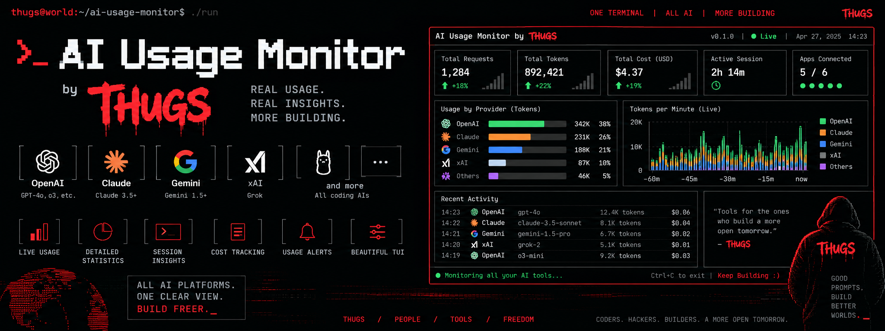
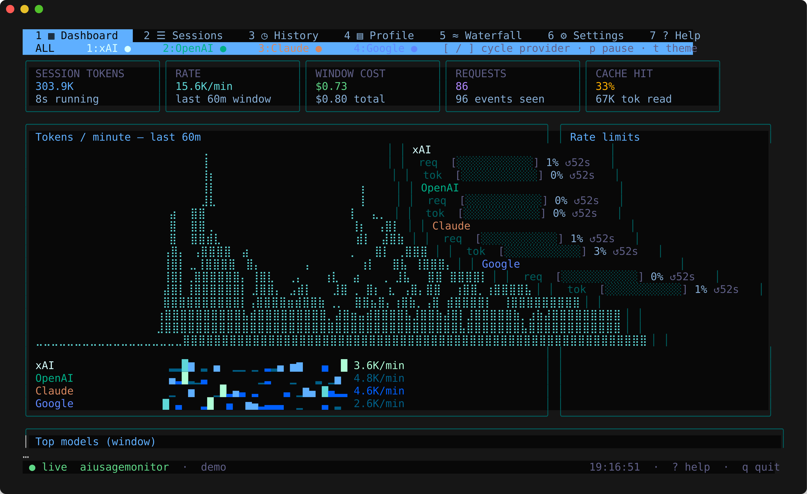
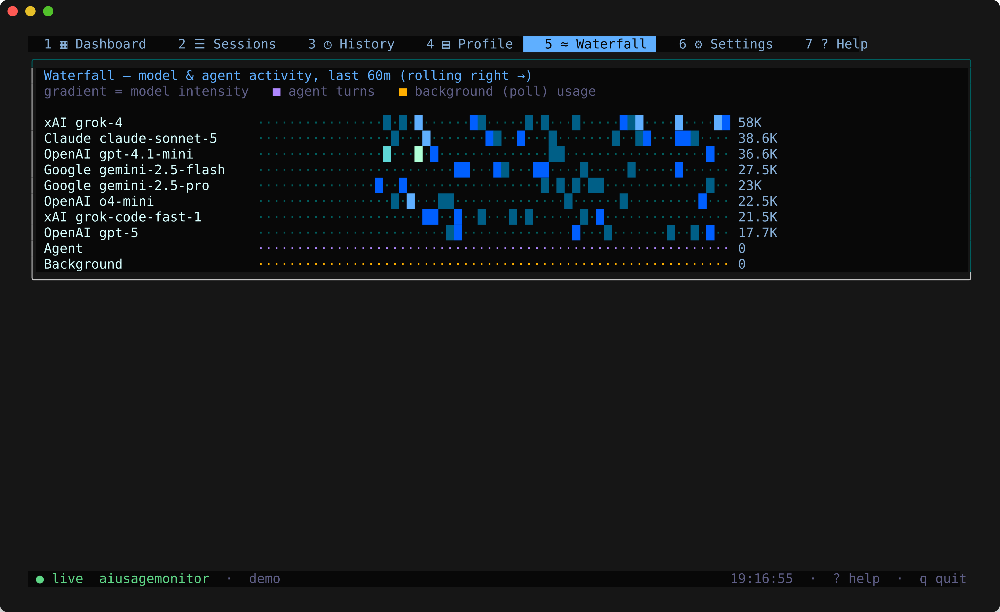
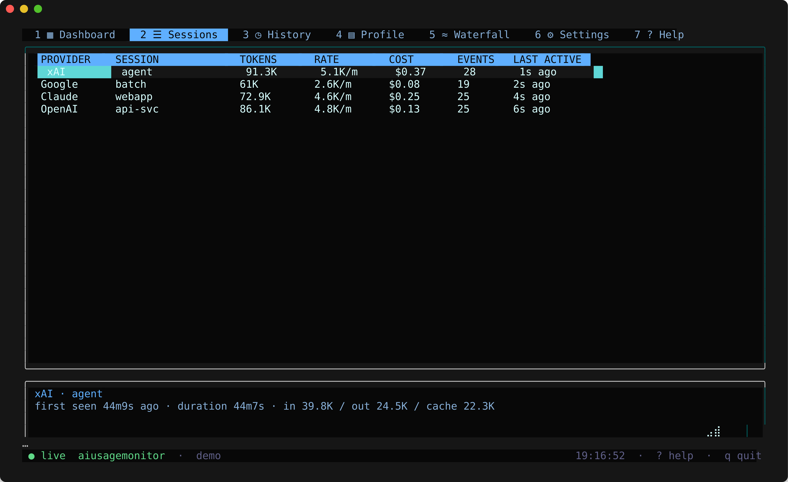
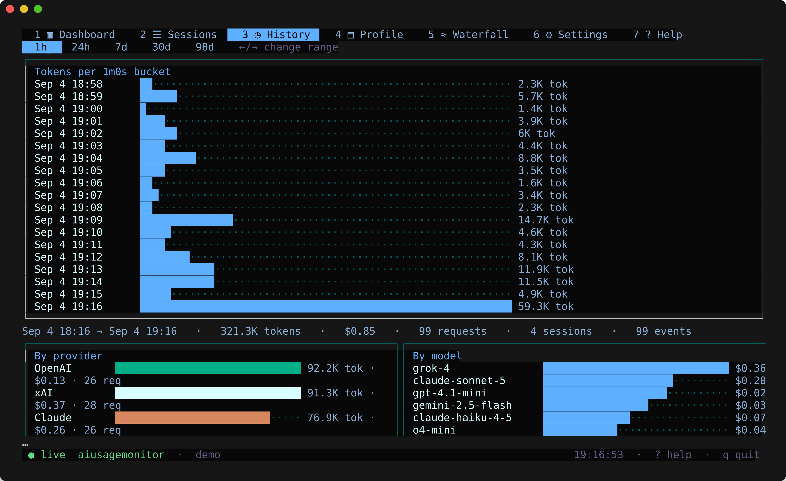
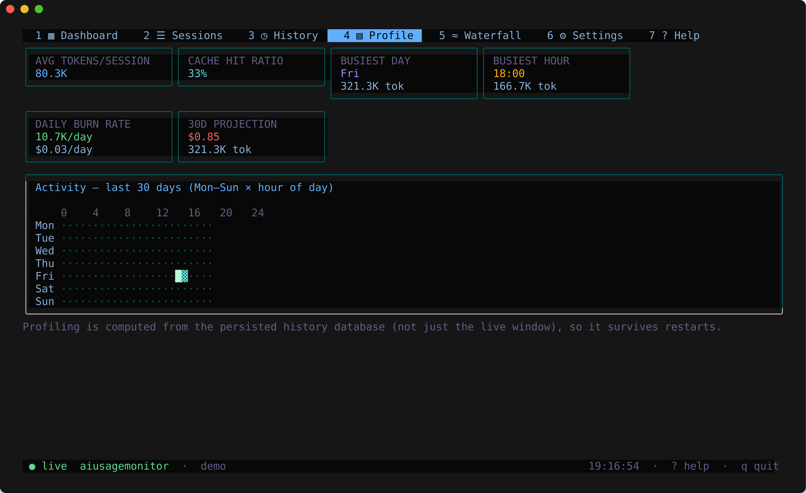
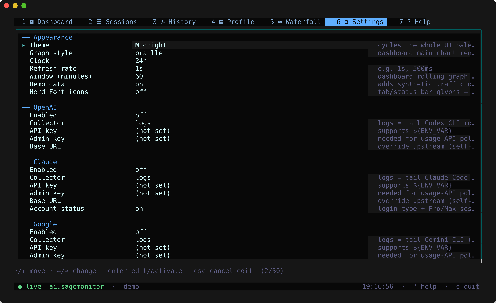
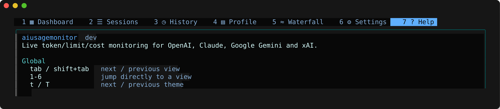

<p align="center">
  
</p>

<h1 align="center">aiusagemonitor</h1>

<p align="center">
  <em>REAL USAGE. REAL INSIGHTS. MORE BUILDING.</em><br>
  <em>A live terminal dashboard for your token spend, rate limits and session history across every major AI vendor.</em><br>
  <a href="https://github.com/kawaiipantsu/aiusagemonitor"><strong>github.com/kawaiipantsu/aiusagemonitor</strong></a>
</p>

<p align="center">
  
  
  
  
  
  
</p>

---

Run `aiusagemonitor` with no arguments and it boots straight into a full-screen
TUI: a tab bar across the top, a live dashboard underneath, and a one-line
footer with a status dot, the active collectors and a ticking clock. Nothing
is forced — no arguments, no config, no API key required — because usage data
comes from **wherever you already have it**: point it at your local
`~/.claude`, `~/.codex` or `~/.gemini` session logs and it starts drawing
graphs immediately, or run `--demo` and it talks to a synthetic feed for all
four vendors so you can explore the entire interface with nothing connected.

From there: it draws a live **braille line chart** of tokens/minute with a
per-provider breakdown underneath, **rate-limit gauges** with countdowns to
reset, a **top-models** cost/usage bar chart, a **sessions** table with a
per-session mini-graph, a **history** view bucketed by hour/day/week over any
range up to "all time", a **profile** view — a Mon–Sun × hour-of-day activity
heatmap, cache-hit ratio, busiest day/hour, and a burn-rate projection — and a
**waterfall** view: a live rolling matrix, one row per busiest model plus
fixed "Agent" and "Background" rows, so you can watch a tool shift between
models (or a subagent kick in) as it happens. All of it is computed from a
local SQLite history that survives restarts. Everything is configured from a
**Settings** tab inside the TUI itself: no config file to hand-edit, though
one exists if you want it.

Running Claude Code against a Claude.ai subscription, it also shows *which*
kind of login is active — subscription (Pro/Max/Team) vs. a pay-as-you-go
console API key — plus the rolling 5-hour session and 7-day weekly usage
allowance, including the "LOW PRIORITY" state Claude Code drops into once
the session window is spent. That reading comes from Claude Code's own local
cache, refreshed only when the CLI itself decides to, so it's tagged with
exactly how stale it is rather than presented as second-by-second truth.

> **YOUR TOKENS. YOUR TERMINAL. YOUR RULES.**

<p align="center">
  <code>aiusagemonitor</code> &nbsp;|&nbsp; <code>aiusagemonitor --demo</code> &nbsp;|&nbsp; <code>aiusagemonitor report --range 7d</code>
</p>

<p align="center">
  
</p>
<p align="center">
  
  
</p>
<p align="center">
  
  
</p>
<p align="center">
  
  
</p>

## What's in the box

| | |
|---|---|
| **Boot** | no args &rarr; alt-screen TUI, opening on the Dashboard tab. Tabs switch with **1–7** or `tab` / `shift+tab`. `--demo` swaps in a synthetic feed for all four vendors, no connection required. |
| **Dashboard** | a live **braille line chart** of tokens/minute over a rolling window (default 60m, configurable), stat cards (session tokens, rate, window cost, requests, cache-hit ratio), per-provider sparklines, **rate-limit gauges** with reset countdowns, and a top-models bar chart by tokens and cost. `[`/`]` cycles the provider filter &middot; `p` pauses live updates &middot; `t`/`T` cycles themes. |
| **Waterfall** | a live rolling matrix — one row per busiest model (gradient-shaded by intensity), plus fixed **Agent** (Claude Code subagent/Task-tool turns) and **Background** (usage the poll collectors picked up outside any interactive request) rows — so you can watch a tool shift between models, or a subagent kick in, as it happens. |
| **Sessions** | every session observed this run — provider, label, tokens, rate, cost, event count, last-active — with a mini braille graph and token breakdown for the selected row. `↑/↓` select &middot; `pgup/pgdn` page. |
| **History** | tokens and cost bucketed by minute/hour/day over **1h / 24h / 7d / 30d / 90d**, plus totals by provider and by model, sourced from the persisted database (not just the live window). `←/→` change range. |
| **Profile** | usage *profiling*: an activity heatmap (weekday × hour of day, last 30 days), average tokens/session, cache-hit ratio, busiest day/hour, daily burn rate and a 30-day cost projection. |
| **Claude account status** | when Claude's collector is "logs", the Dashboard also shows your Claude Code **login type** — Claude.ai subscription (Pro/Max/Team) vs. a pay-as-you-go console API key — and, for a subscription, the rolling 5-hour session and 7-day weekly usage allowance in both the top bar and the Rate limits box, including **"LOW PRIORITY"** once the session window is spent. This reads Claude Code's own local cache (`~/.claude.json`), which it refreshes on its own schedule rather than per-request, so every reading is tagged with exactly how stale it is (`Claude Code cache, Xm old`) instead of being presented as real-time. Only plan/quota metadata is read — never your OAuth tokens, email or name. Toggle it off in Settings ▸ Claude ▸ Account status. |
| **Settings** | a full in-TUI form: per-provider enable/collector/API key/admin key/base URL, the local proxy's listen address, poll interval, history DB path and retention, theme, graph style, refresh rate, window size and Nerd Font icons. Appearance changes apply live; provider/collector changes apply on **Save & apply**, which also persists to `~/.config/aiusagemonitor/config.yaml` (0600, secrets support `${ENV_VAR}` expansion). |
| **Collectors** | three ways to gather usage, mixed and matched per provider: **logs** (tail Claude Code / Codex CLI / Gemini CLI session transcripts locally — no key needed), **proxy** (a built-in local reverse proxy that records real request/response token counts *and* rate-limit headers as your SDK's traffic passes through), **poll** (periodically call a vendor's usage/admin API — coarser, needs an admin-scoped key). |
| **CLI** | `report` (`--range 1h\|24h\|7d\|30d\|90d\|all`, `--json`) for scripts/cron &middot; `proxy` runs the capture proxy headlessly, no TUI &middot; `paths` prints the resolved config/db locations &middot; `version`. |
| **Storage** | a local SQLite history (`modernc.org/sqlite`, pure Go — no cgo, no C toolchain needed to build or cross-compile) with configurable retention and automatic pruning. |
| **Appearance** | ten built-in themes (Midnight, Dracula, Nord, Gruvbox, Tokyo Night, Solarized, Matrix, Ember, Paper, High Contrast), and an optional **Nerd Font icon** set for the tab bar and status bar (Settings ▸ Appearance ▸ Nerd Font icons) — off by default, since it needs a patched Nerd Font in your terminal to render correctly. |
| **Under it** | **Go 1.27+**, `CGO_ENABLED=0`, one static binary. TUI on [Bubble Tea](https://github.com/charmbracelet/bubbletea) / Bubbles / Lipgloss. |

## Quick start

```bash
git clone https://github.com/kawaiipantsu/aiusagemonitor.git && cd aiusagemonitor
make build

./bin/aiusagemonitor --demo     # kick the tyres with a synthetic feed, nothing connected
./bin/aiusagemonitor            # for real — configure providers from the Settings tab (6)
```

Head-less, straight from the shell:

```bash
aiusagemonitor report --range 7d              # text summary for the last 7 days
aiusagemonitor report --range 30d --json       # machine-readable, for a status bar or cron
aiusagemonitor proxy --listen 127.0.0.1:8317   # capture proxy only, no TUI
```

### Connecting a real provider

Pick a collector per vendor in **Settings** (6):

- **logs** — no key needed. Tails `~/.claude/projects` (Claude Code), `~/.codex/sessions`
  (Codex CLI) or `~/.gemini/tmp` (Gemini CLI, experimental) for token usage as you code.
- **proxy** — point your SDK's base URL at `http://<listen>/openai`, `/anthropic`, `/google`
  or `/xai` (the local capture proxy forwards everything upstream unchanged, including
  auth headers) for exact, real-time token counts *and* rate-limit headers.
- **poll** — set an admin-scoped key and aiusagemonitor periodically calls the vendor's
  usage-report API (OpenAI and Anthropic today) for org-wide totals.

### Packages

```bash
make dist              # linux/windows/macOS, amd64/386/arm64/armv7  -> dist/*.tar.gz
make deb                # .deb for amd64/i386/arm64/armhf via dpkg-deb -> dist/*.deb
make release            # dist + deb + SHA256SUMS

sudo make install                  # /usr/local/bin/aiusagemonitor
sudo dpkg -i dist/aiusagemonitor_*_amd64.deb   # or the Debian way
```

## How it works

One Bubble Tea model owns the screen and routes key events to the active
tab. A pluggable **collector** per provider (log tailer, capture proxy, or
API poller) streams `Event`/`Limit`/`Account` observations onto a channel; the
**engine** dedupes, prices (a built-in cost table, overridable per model),
aggregates into rolling in-memory windows, and buffers every observation to
SQLite. A ticker rebuilds an immutable `DashboardState` snapshot and
broadcasts it to the UI — the Dashboard renders it live, while History and
Profile query the persisted database directly so they survive restarts.
Charts are hand-rolled: braille rasterisation for the line chart, block-glyph
bars and a shaded heatmap — nothing to render but text.

## Layout

```
cmd/aiusagemonitor/      entry point: TUI by default, or report | proxy | paths | version
internal/
  app/                   Bubble Tea root model: tabs, global keybindings, resize
  collector/              logs (Claude Code · Codex CLI · Gemini CLI) · claude-account · proxy · poll · demo
  engine/                 dedup, pricing, in-memory aggregation, DashboardState snapshots
  store/                  SQLite history (pure Go) + the History/Profile queries
  config/                 ~/.config/aiusagemonitor/config.yaml load/save
  pricing/                model -> $/Mtok cost table, user-overridable
  theme/                  ten built-in palettes, Nerd Font / plain icon sets
  ui/
    components/           sparkline · braille line chart · bars · gauge · heatmap · waterfall · stat card
    views/                Dashboard · Sessions · History · Profile · Waterfall · Settings · Help
packaging/               Debian control script, man page, copyright
assets/                  banner + screenshots
Makefile                 build · dist (cross-compile) · deb · install
```

## License

MIT — see [LICENSE](LICENSE).

<p align="center"><sub>built for <a href="https://thugs.red">thugs.red</a> &middot; YOUR TOKENS. YOUR TERMINAL. YOUR RULES.</sub></p>
